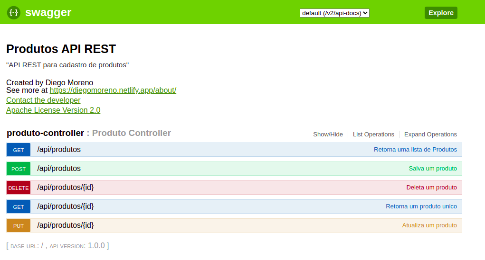

# Spring boot application With Swagger and deploy into Heroku

<!---Esses são exemplos. Veja https://shields.io para outras pessoas ou para personalizar este conjunto de escudos. Você pode querer incluir dependências, status do projeto e informações de licença aqui--->

> A simple REST API with Spring boot.

### Adjustments and improvements

The project is still under development and future updates will focus on the following tasks:

- [x] Doing

## 💻 Pré-requisites

Before starting, make sure you have met the following requirements:
<!---Estes são apenas requisitos de exemplo. Adicionar, duplicar ou remover conforme necessário--->
* You have installed the latest version of `<Java/ Spring boot>`
* You have an `<Windows / Linux / Mac>`. 

## 🚀 How to execute

Just open the root folder of this project where found src subfolder with your favorite editor (IDE).

## ☕ [Getting Started Spring boot ](https://docs.spring.io/spring-boot/docs/current/reference/html/getting-started.html "Getting Started Spring boot ")

[Swagger](http://localhost:8080/swagger-ui.html#/ "Swagger")

[⬆ Voltar ao topo](#nome-do-projeto) 

